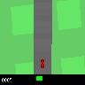
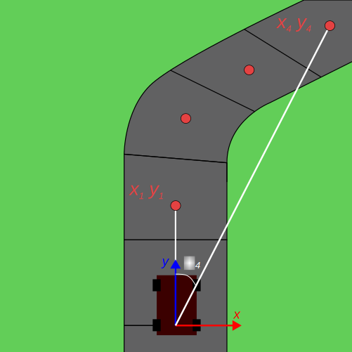

# Car Racing

## Description

 

Original observation space is RGB image $96 \times 96$.

Ground truth is used as privileged information: 

* $v$ linear velocity
* $\omega$ angular velocity
* $x, y$ cartesian coordinates
* $d$ cartesian distance <!-- = \sqrt{x^2 + y^2} -->
* $\varphi$ yaw angle

## Results
