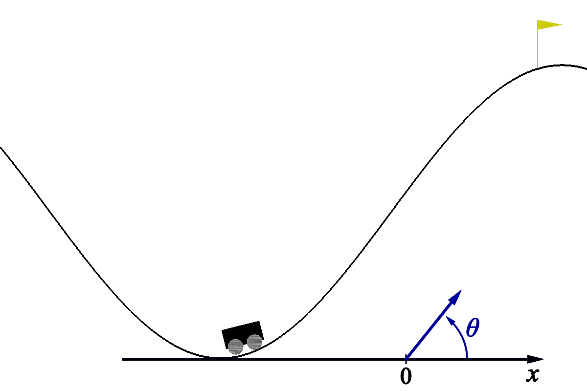

# Cart Pole

## Description
Description of gym on [gymnasium](https://gymnasium.farama.org/environments/classic_control/cart_pole/ "Cart Pole") page.

 

Original observation space is

* $x$ position of the car along the x-axis
* $\dot{x}$ velocity of the car

Privileged information -- angle $\theta$.

## Results

